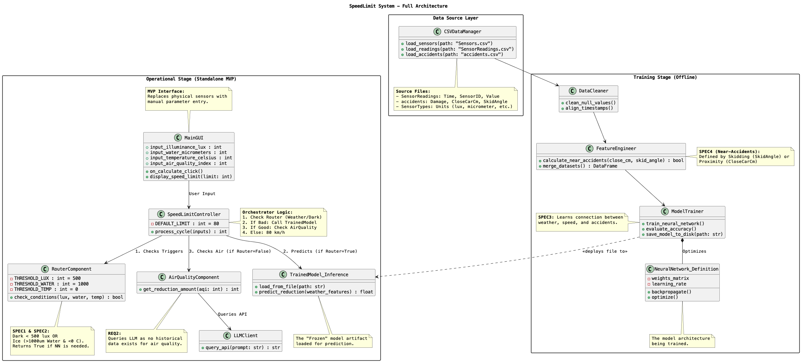

# SpeedLimit: Intelligent Traffic Control System

**SpeedLimit** is an adaptive traffic control system designed to dynamically adjust highway speed limits based on real-time weather conditions and air quality. It utilizes a microservices architecture combining Rule-Based Logic, Neural Networks (TensorFlow), and Large Language Models (OpenAI).

---

## 📖 Project Overview

This project implements a "SpeedLimit Software" that operates in two main stages:
1.  **Training Stage (Offline):** Processing historical sensor data (weather, accidents) to train a Neural Network for risk prediction.
2.  **Operational Stage (Online):** A live system where an Operator GUI sends environmental parameters to a controller, which orchestrates decisions between a Router, an AI Inference Engine, and an LLM agent.

## 🏗 Architecture

The system is built as a set of Dockerized microservices orchestrated by a central Controller.



### Microservices
* **Main GUI (Tkinter):** An "MVP" operator interface to simulate sensor inputs (Temperature, Water Level, Light, AQI).
* **Controller Service (FastAPI):** The gateway that receives user input and orchestrates the logic flow.
* **Router Component:** Determines if weather conditions are hazardous (Darkness or Black Ice).
* **Model Inference Service:** Hosts the pre-trained Neural Network to predict accident risk during hazardous weather.
* **Air Quality Agent:** Uses an LLM (OpenAI GPT-4o-mini) to recommend speed reductions based on Air Quality Index (AQI) when weather is safe.

---

## 🚀 Getting Started

### Prerequisites
* **Docker & Docker Compose**
* **Python 3.11+** (for local training/testing)
* **OpenAI API Key** (for the Air Quality Agent)

### 1. Environment Setup
Create a `.env` file in the `app/` directory:
```bash
OPENAI_API_KEY=your_api_key_here
CONTROLLER_URL=http://localhost:8080
````

### 2\. Run with Docker (Recommended)

The entire operational stage can be spun up using Docker Compose.

```bash
cd app/speedlimit-docker
docker-compose up --build
```

**Service Endpoints:**

  * Controller: `http://localhost:8080`
  * Router: `http://localhost:8001`
  * Inference: `http://localhost:8002`
  * Air Quality: `http://localhost:8000`

### 3\. Launch the Client GUI

Once the Docker containers are running, open a new terminal to launch the operator interface:

```bash
# From the project root
cd app
python main_gui.py
```

-----

## 🧠 Training Pipeline (Data Science)

The neural network is trained on historical sensor and accident data. To reproduce the model:

1.  **Data Aggregation:** Merges raw CSV sensor readings and accident logs.
    ```bash
    cd data
    python 01_data_pipeline.py
    ```
2.  **Preprocessing:** Handles missing values, scales features, and balances the dataset (Hybrid Boosting for Black Ice detection).
    ```bash
    python 02_preprocessing.py
    ```
3.  **Model Training:** Trains the TensorFlow model and saves artifacts (`.keras`, scaler, etc.).
    ```bash
    python 03_training.py
    ```

*Note: The trained model artifacts must be placed in `app/ModelInference/` for the Docker container to pick them up.*

-----

## ⚙️ Logic & Specifications

The system decides the speed limit (Baseline: 80 km/h) based on the following precedence logic:

1.  **Router Check:**

      * **Darkness:** If Illuminance \< 500 Lux.
      * **Black Ice:** If Water Level \> 1000 $\mu m$ AND Temperature \< 0°C.
      * *Result:* If either is true, control is passed to the **Neural Network**.

2.  **Neural Network Inference:**

      * Used only during hazardous weather.
      * Predicts "Near Accidents" per hour for speeds 130 down to 60 km/h.
      * Selects the highest speed where predicted risk \< 1.0.

3.  **Air Quality (LLM):**

      * Used only if weather is **Safe**.
      * Queries GPT-4o to reduce speed (e.g., -10 km/h) based on AQI severity.

-----

## 📂 Repository Structure

```text
.
├── app/
│   ├── AirQualityLLM/       # LLM Integration Service
│   ├── ModelInference/      # TensorFlow Inference Service
│   ├── RouterComponent/     # Rule-based Logic Service
│   ├── SpeedLimitController/# Orchestrator Service
│   ├── speedlimit-docker/   # Docker configuration
│   ├── main_gui.py          # Operator Interface
│   └── system_test.py       # Integration Tests
├── data/
│   ├── 01_data_pipeline.py  # ETL Script
│   ├── 02_preprocessing.py  # Feature Engineering
│   ├── 03_training.py       # Model Training
│   └── *.csv                # Raw Data
└── Plans/                   # UML Diagrams
```

## 🧪 Testing

To run system integration tests (requires Docker services to be running):

```bash
cd app
pytest system_test.py
```
